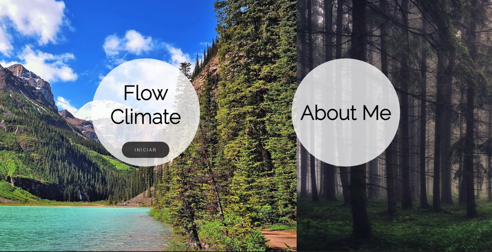
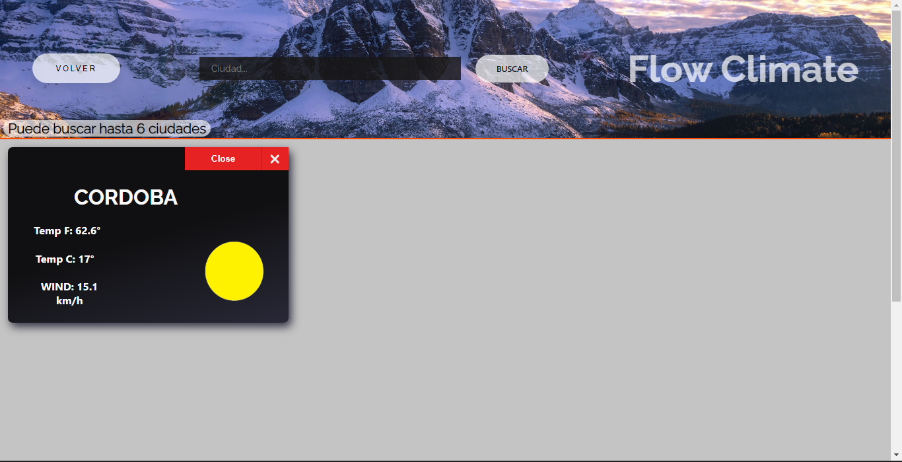

# FLOW CLIMATE

Flow Climate is a single page application developed by Alejo Bengoechea, where you will find every city in the world with each metheorologic updated information. This platform consumes data from a rest API.

## Proyect Objectives

-  Build an App using React and Node.
-  Affirm and connect the concepts learned through the course.
-  Learn better programming practices.
-  Learn and practice Git's workflow.

## Technologies Stack:

Front-End:
- React
- Redux
- HTML
- CSS

## Project Screens:

 
 

